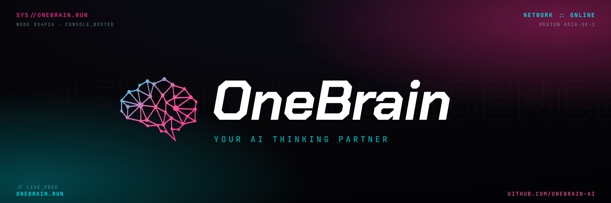

<p align="center">
  
</p>

<p align="center">
  <a href="LICENSE"></a>
  <a href="https://github.com/kengio/onebrain/stargazers"></a>
  <a href="https://github.com/kengio/onebrain/commits/main"></a>
</p>

<h1 align="center">OneBrain</h1>

<h3 align="center">Turn Claude Code, Gemini CLI, or any AI agent into a thinking partner that remembers everything — right inside your Obsidian vault.</h3>

---

## Features

**🧠 Memory across sessions** — Your AI remembers your name, goals, preferences, and past conversations. Every session picks up where the last one left off.

**⚡ 18 slash commands** — Braindump, capture, research, consolidate, connect, bookmark, import files, and more. Capture an idea or deep-research a topic in seconds.

**📂 Vault-native Markdown** — Every note is plain Markdown. No lock-in, no proprietary format. Your data stays in your vault, forever.

**🤖 Multi-agent** — Works with Claude Code, Gemini CLI, or any AI that reads Markdown instructions. Switch agents without losing context.

**🔌 Zero config** — Clone the repo, open in Obsidian, run `/onboarding`. Your vault and AI are ready in under 2 minutes.

**📓 Session logs** — Every conversation is auto-saved with summaries, decisions, and action items. Nothing gets lost between sessions.

**🔗 Knowledge synthesis** — `/consolidate` processes your inbox into permanent, connected knowledge — turning raw notes into insights you can actually find.

**🎓 Teach your AI** — `/learn` lets you permanently shape how your agent thinks and responds. Teach it your stack, your team, your preferences.

---

## Quick Start

**macOS / Linux:**

```bash
curl -fsSL https://raw.githubusercontent.com/kengio/onebrain/main/install.sh | bash
```

**Windows (PowerShell):**

```powershell
irm https://raw.githubusercontent.com/kengio/onebrain/main/install.ps1 | iex
```

> Or clone manually: `git clone https://github.com/kengio/onebrain.git`

### Get Running

1. **Open in Obsidian** — Open folder as vault, install community plugins when prompted
2. **Start your agent** — Open the terminal plugin, run `claude` or `gemini`
3. **Run `/onboarding`** — 2 minutes to personalize your vault and AI assistant

---

## Supported Agents

| Agent | Instruction file | Setup |
|-------|-----------------|-------|
| Claude Code | `CLAUDE.md` | Loaded automatically |
| Gemini CLI | `GEMINI.md` | Loaded automatically |
| Any agent | `AGENTS.md` | Read manually or via system prompt |

---

## How It Works

After `/onboarding`, your AI agent:
- Addresses you by your preferred name and matches your communication style
- Greets you each session with inbox status and context from the last session
- Remembers your goals, projects, and preferences indefinitely
- Suggests next actions based on what's in your vault

Under the hood, OneBrain uses a **three-layer memory system**: your identity (always loaded), domain knowledge and behavioral patterns (loaded when relevant), and a searchable session history. See details below.

---

<details>
<summary><strong>📋 All 18 Commands</strong></summary>
<br>

| Command | What it does |
|---------|-------------|
| `/onboarding` | First-run setup — run this first |
| `/braindump` | Dump everything on your mind — it gets classified and filed |
| `/capture` | Quick note with auto-linking to related notes |
| `/bookmark [url]` | Save a URL with AI-generated name, description, and category to Bookmarks.md |
| `/consolidate` | Process inbox into permanent knowledge |
| `/connect` | Find connections between notes, suggest wikilinks |
| `/research [topic]` | Web research → structured note in your vault |
| `/summarize [url]` | Fetch a URL and save a deep summary note |
| `/import [path]` | Import local files (PDF, Word, images, scripts) into vault notes |
| `/reading-notes` | Turn a book or article into structured notes |
| `/weekly` | Review the week, surface patterns, set intentions |
| `/tasks` | Task dashboard — overdue, due soon, open, and completed this week |
| `/wrapup` | Wrap up session and save summary to session log |
| `/learn` | Teach the agent something — facts about your world or behavioral preferences |
| `/clone` | Package your agent context for transfer to a new vault |
| `/reorganize` | Migrate flat notes into organized subfolders |
| `/update` | Update skills, config, and plugins from GitHub |
| `/help` | List all available commands with descriptions |

</details>

<details>
<summary><strong>📁 Vault Structure</strong></summary>
<br>

Vault folders are created during `/onboarding`.

```
onebrain/
├── 00-inbox/          Raw braindumps and captures (process regularly)
│   └── imports/       Staging area for /import (drop files here)
├── 01-projects/       Active projects with inline tasks
├── 02-areas/          Ongoing responsibilities (health, finances, career...)
├── 03-knowledge/      Your own synthesized thinking and insights
├── 04-resources/      External info — research output, summaries, reference
├── 05-agent/          AI-specific context and memory
│   ├── MEMORY.md      Your identity — loaded every session
│   ├── context/       Domain facts the AI reads when relevant
│   └── memory/        Behavioral patterns the AI has learned
├── 06-archive/        Completed projects and archived areas
├── 07-logs/           Session logs (YYYY-MM-DD-session-NN.md in YYYY/MM/)
├── attachments/       Copied files from /import --attach
│   ├── pdf/
│   ├── images/
│   └── video/
├── CLAUDE.md          Instructions for Claude Code
├── GEMINI.md          Instructions for Gemini CLI
├── AGENTS.md          Universal agent instructions
├── vault.yml          Your vault configuration (created during onboarding)
└── .claude/plugins/   AI skills and hooks
```

The core workflow: capture everything to inbox → process with `/consolidate` → synthesize into knowledge or save as reference → archive what's done.

**`00-inbox/`** — Raw braindumps and captures
Process regularly. Everything unclassified lands here first. The `imports/` subfolder is the staging area for `/import` — copy files there and run `/import` to distill them into vault notes.

**`01-projects/`** — Active work with a clear goal and end date
Examples: `work/Website Redesign.md`, `personal/Japan Trip 2026.md`

**`02-areas/`** — Ongoing responsibilities that never "complete"
Examples: `health/Running Log.md`, `finances/Budget 2026.md`

**`03-knowledge/`** — Your own synthesized thinking
Conclusions, frameworks, and insights you've developed — not raw reference material.
Examples: `productivity/Deep Work Principles.md`, `technology/When to Use Microservices.md`

**`04-resources/`** — External information saved for reference
Output from `/research`, `/summarize`, `/reading-notes`, `/import`, and saved reference material.
Examples: `research/Zettelkasten Method.md`, `code-snippets/Go HTTP Middleware.md`

**`05-agent/`** — Your agent's portable mind
Everything the AI knows about you. Copy this folder to move your agent to a new vault.
- `MEMORY.md` — identity, goals, communication style (loaded every session)
- `context/` — domain facts: your stack, team, product, terminology
- `memory/` — behavioral patterns: preferences and observations from past sessions

**`06-archive/`** — Completed projects and retired areas
Organized by date archived: `06-archive/YYYY/MM/`.

**`07-logs/`** — Session logs
One file per AI session: `07-logs/YYYY/MM/YYYY-MM-DD-session-NN.md`. Generated by `/wrapup` or auto-saved at session end.

</details>

<details>
<summary><strong>🧠 Memory System</strong></summary>
<br>

OneBrain uses a three-layer memory system:

**Layer 1 — `05-agent/MEMORY.md`** (always loaded, ~200 lines max)
Your identity: name, role, goals, communication style, recurring context. The AI reads this at the start of every session and uses it to personalize responses.

**Layer 2 — `05-agent/`** (persistent agent knowledge)
Long-lived facts and preferences that don't fit in `MEMORY.md`. Two subfolders: `context/` for domain knowledge (your stack, team, customers) and `memory/` for behavioral patterns (how you like to work). Managed by `/learn`. Clone everything with `/clone` when switching vaults.

**Layer 3 — `07-logs/`** (searchable session history)
One file per session: `YYYY-MM-DD-session-NN.md`, organized into `YYYY/MM/` subfolders. Contains summaries, decisions, insights, and action items. Generated by `/wrapup` at the end of each session.

### Task Syntax

OneBrain uses the [Obsidian Tasks](https://publish.obsidian.md/tasks/) plugin format:

```
- [ ] Task description 📅 2026-03-25
- [ ] High priority task 🔺 📅 2026-03-22
```

Tasks live inline in your notes — the Tasks plugin surfaces them across the vault.

</details>

<details>
<summary><strong>⚙️ Prerequisites & Detailed Setup</strong></summary>
<br>

### Prerequisites

**Required:** [git](https://git-scm.com) — used to version-control your vault.

| Platform | Install command |
|----------|----------------|
| macOS (Homebrew) | `brew install git` |
| macOS (Xcode CLT) | `xcode-select --install` |
| Windows (winget) | `winget install --id Git.Git` |
| Windows (Chocolatey) | `choco install git` |
| Debian / Ubuntu | `sudo apt install git` |
| Fedora / RHEL | `sudo dnf install git` |
| Arch | `sudo pacman -S git` |

Verify with `git --version` before running the installer.

### Community Plugins

These three plugins are pre-configured in vault settings — install them via **Settings → Community plugins → Browse**, then click **Trust author and enable plugins** when prompted:

- **Tasks** — task management with due dates
- **Dataview** — query notes like a database
- **Terminal** — run your AI agent from within Obsidian

These are recommended but optional:

- **Templater** — advanced templates
- **Calendar** — visual calendar view
- **Tag Wrangler** — manage tags across vault
- **QuickAdd** — fast capture workflows
- **Obsidian Git** — version control for your vault

### Claude Code Skills (Optional)

For Obsidian-specific Claude Code skills (markdown, bases, canvas, and more), install the [Obsidian Skills](https://github.com/kepano/obsidian-skills) plugin separately by cloning it into your vault's `.claude/plugins/` directory.

</details>

---

## Customization

Edit `05-agent/MEMORY.md` directly to update your identity, goals, or recurring context at any time. The AI picks up changes on the next session start.

## Contributing

Pull requests welcome. See [CONTRIBUTING.md](CONTRIBUTING.md) for guidelines.

## License

[MIT](LICENSE)
